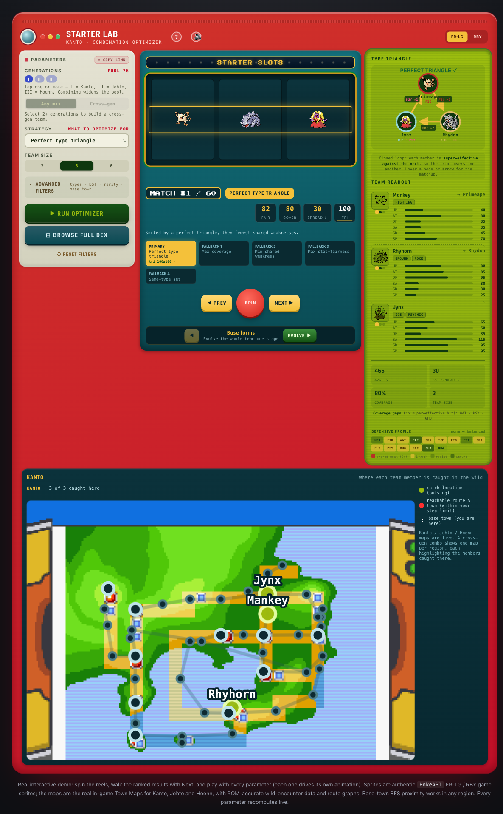
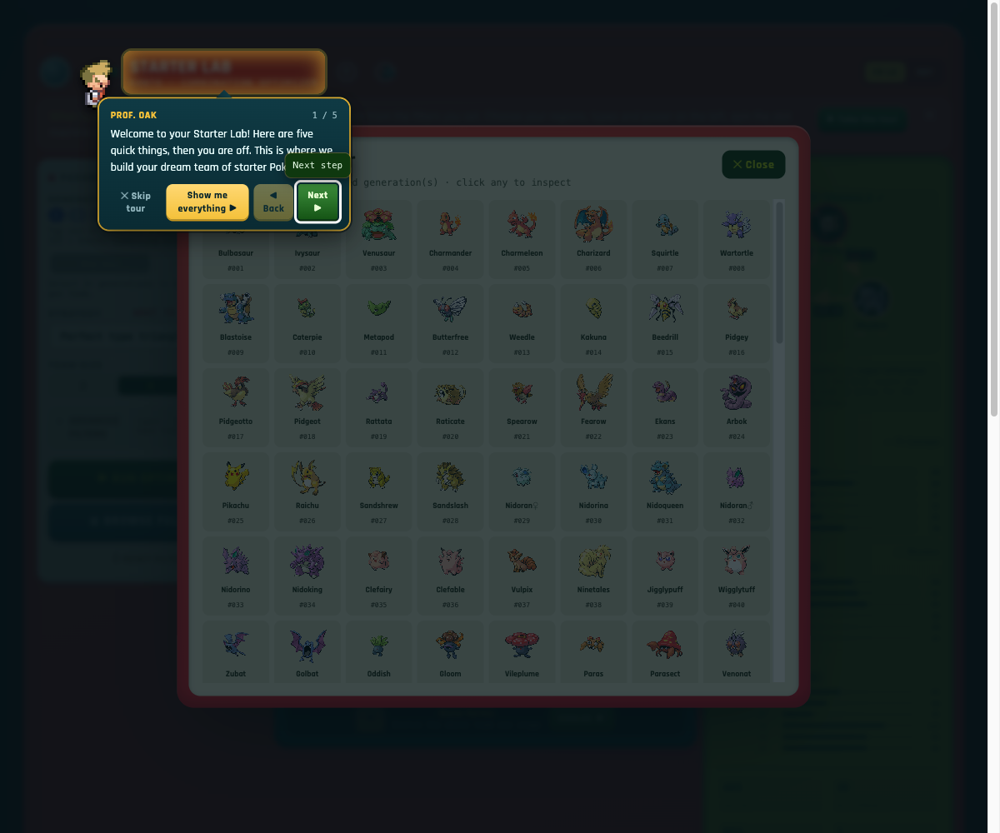
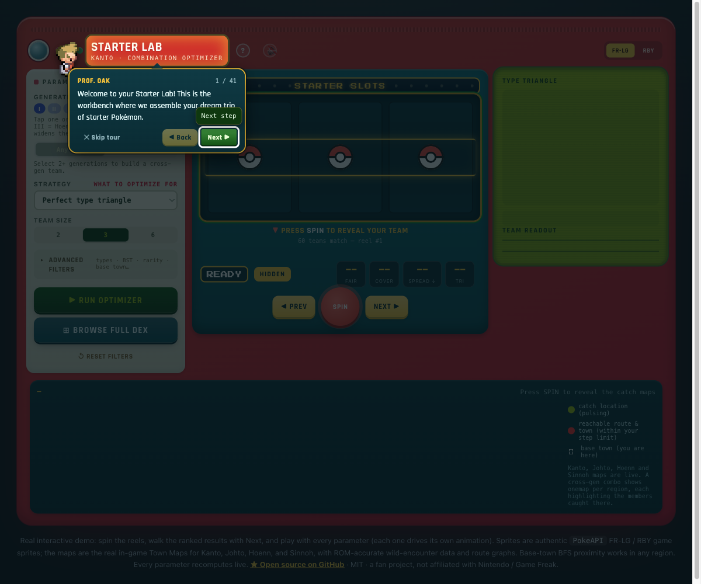
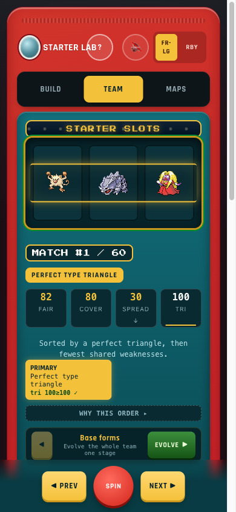

<div align="center">
  <br>
  <h1>Poké Starters</h1>
  <p>
    Find the optimal Pokémon starter trio across Gens 1 to 4.<br>
    Perfect type triangles, defensive coverage, and where to catch every member.<br>
    One page. No build step. No backend.
  </p>
  <br>

  **[Live demo &rarr;](https://poke-starters-demo.gkos.dev)**

  <br>

  [](https://vercel.com/new/clone?repository-url=https%3A%2F%2Fgithub.com%2Fdrkostas%2Fpoke-starters)

  <br>

  [](./LICENSE)
  [](https://github.com/drkostas/poke-starters/actions)
  [](#how-it-works)
  [](#tests)
  [](#accessibility)

  <br><br>
  
</div>

---

## What it does

> Inspired by MandJTV's video [Everyone Else's Starter Pokémon](https://www.youtube.com/watch?v=xNzYtLNEZjg): if you didn't live next to the professor, what starter trio could you actually catch near your town? This project turns that question into a search you can run for any base town across Kanto, Johto, and Hoenn.

Pick your regions, types, and power budget on the left. The optimizer searches every legal combination of evolution lines and ranks the results, then a slot machine reveals the top team. The right panel shows **why** that trio wins (a closed type-effectiveness loop, defensive coverage, stat balance), and the maps below show **where to catch** each member on the real in-game Town Maps.

Everything runs in the browser. The heavy search happens on a Web Worker, so the interface stays smooth, and a shareable URL captures your exact settings.

## How it works

- **The engine** (`src/engine/optimizer.mjs`) scores every eligible trio with bitmask type math, a real directed-Hamiltonian-cycle test for "perfect triangles" (each member is super-effective against the next), defensive coverage, shared-weakness, and stat-fairness. It runs era-aware: a Gen-1-only query uses the authentic 15-type Gen-1 chart, quirks and all.
- **The maps** are the real Kanto, Johto, Hoenn, and Sinnoh Town Maps with ROM-accurate wild-encounter tables and route graphs. A base-town search runs a breadth-first walk over the region graph to show what is reachable within a step budget. It also models obtainability the way a trainer just starting out would face it: open-water routes need Surf, and encounters that need the Super Rod, a fossil, or a trade are set aside, so the pool reflects what you could actually catch near that town.
- **The reveal** is a gated slot machine: nothing is shown until you spin, so the result is never spoiled. You can then walk the ranked list, evolve the whole team a stage at a time, and swap the art between FireRed/LeafGreen and Red/Blue/Yellow sprites.
- **The build** is a single self-contained `lab.built.html`: `app/build_lab.py` inlines the fonts, the guided-tour data, and the Professor Oak sprite as data URIs. Sprites, maps, and data are fetched at runtime.

## Features

|  |  |
|---|---|
|  | **Full Pokédex browser** with authentic sprites. Click any species to see its stats, evolution line, type matchups, and every place it is caught in the wild. |
|  | **A guided walkthrough.** Professor Oak walks the page and explains every control, with a short first-time tour and a full 41-step version on demand. |
|  | **A real mobile layout, not a reflow.** The page splits into `Build`, `Team`, and `Maps` tabs, SPIN and the result-walker pin to the thumb zone, and the type scale is tuned for small screens. |

Other things it does: synthesized Game-Boy-style sound effects (mutable), a shareable link for any configuration, an auto-relax ladder that loosens over-tight filters and tells you what it dropped, and a live defensive matrix that highlights which members drive each weakness.

## Run it locally

No install, no bundler. You only need Python 3 to serve the files (any static server works).

```bash
git clone https://github.com/drkostas/poke-starters.git
cd poke-starters
npm run serve         # serves app/ on http://localhost:4788/lab.built.html
```

To rebuild `lab.built.html` from its template and assets after editing:

```bash
npm run build         # runs app/build_lab.py
```

## Deploy your own

The app is static, so any host works. The included `vercel.json` serves the `app/` directory with `/` mapped to the built page.

One click, using the button at the top:

[](https://vercel.com/new/clone?repository-url=https%3A%2F%2Fgithub.com%2Fdrkostas%2Fpoke-starters)

Or from the CLI:

```bash
npm i -g vercel
vercel            # preview
vercel --prod     # production
```

## Project structure

```
app/                 the shipped app
  lab.built.html     single-file build (this is what deploys)
  lab.template.html  source template (build input)
  build_lab.py       inlines fonts + tour + Oak sprite -> lab.built.html
  server.py          no-cache static server for local dev
  optimizer.mjs      engine copy imported by the app + worker
  worker.mjs         Web Worker that runs the search off the main thread
  data/ sprites/ maps/ fonts/
src/engine/          the optimizer source of truth (+ its checks)
data-pipeline/       scripts that generate data/ and the sprite + map assets
tests/               node --test engine tests + Playwright e2e (cross-browser)
screenshots/         images used in this README
```

## Tests

```bash
npm test              # engine unit + invariant tests (node --test)
npm run test:e2e      # end-to-end flows on Chromium, WebKit, and Firefox
```

The engine tests assert the scoring invariants and guard that the two engine copies never drift. The end-to-end suite drives the real build across three browser engines and checks the gated reveal, the modal focus-trap, evolve, the tour, and share links. CI runs both on every pull request.

## Accessibility

The interface is built to be operated by keyboard and screen reader, not only a mouse. It uses landmark regions, a single page heading, ARIA state on every control, a live region for results, a real focus-trap on dialogs, and honors `prefers-reduced-motion` and `forced-colors`. Color contrast passes WCAG AA, verified with axe.

## Data provenance

Kanto, Johto, and Hoenn (Gens 1 to 3) wild-encounter tables and route graphs are derived from the game data via the pret decompilations. Sinnoh (Gen 4) encounters come from [PokéAPI](https://pokeapi.co) (Platinum), with a route graph built from the Platinum region layout. The Sinnoh Town Map is fan-made artwork by ICEREG1992 ([pkmnmap4](https://github.com/ICEREG1992/pkmnmap4)), used with permission; the region's node coordinates are snapped to it. Sprites are the authentic game sprites via PokéAPI. The type charts are validated cell by cell against PokéAPI. See [`data-pipeline/`](./data-pipeline) for how the assets are generated.

## Contributing

Contributions are welcome. See [CONTRIBUTING.md](./CONTRIBUTING.md) for the setup, the test commands, and the pull-request flow, and the [open issues](https://github.com/drkostas/poke-starters/issues) for a roadmap and good first tasks.

## License

[MIT](./LICENSE) &copy; 2026 Kostas Georgiou.

> This is a fan-made, non-commercial project. Pokémon, Pokédex, and all names and sprites are trademarks of Nintendo, Game Freak, and The Pokémon Company. This project is not affiliated with or endorsed by them.
